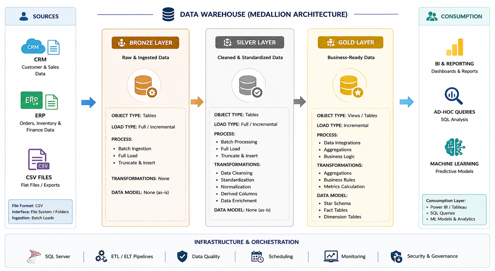

# End-to-End Data Engineering and Analytics Project


Welcome to the Data Engineering and Analytics Project repository. 

## 🎯 Project Objective

This project demonstrates a comprehensive end-to-end data engineering solution — from business analysis and relational database design to building a modern data warehouse and generating actionable insights. It highlights industry best practices in data engineering and analytics.

## 📖 Project Overview

The project involves:

1. **Business Analysis**: Understanding the business requirements, identifying core business entities, and defining their relationships.
2. **Data Modeling**: Designed a conceptual ERD, resolved many-to-many relationships with bridge tables, and built a normalized 3NF operational database.
3. **Data Warehouse Architecture**: Building a Medallion Architecture (Bronze, Silver, and Gold) to organize raw, cleansed, and business-ready data.
4. **ETL Pipelines**: Developing automated stored procedures to extract, cleanse, transform, and load data from  source files into the Data Warehouse.
5. **Dimensional Modeling**: Designing a Sales Data Mart using a Star Schema with fact and dimension tables optimized for analytical reporting.
6. **ETL Automation**: Scheduling the complete ETL pipeline using SQL Server Agent for automated daily execution and monitoring.
7. **Analytics & Reporting**: Developed SQL-based analytical reports and KPIs, and built an interactive Power BI sales dashboard to deliver actionable business insights.

## Project Development Workflow
```text
Business Case Understanding
        |
        v
Identify Main Business Entities
        |
        v
Create ERD and Define Relationships
        |
        v
Resolve Many-to-Many Relationships Using Bridge Tables
        |
        v
Apply 3NF Normalization for the Operational Model
        |
        v
Design Data Warehouse Model
        |
        v
Build Star Schema with Facts and Dimensions
        |
        v
Develop ETL Pipeline and Analytics Reports
        |
        v
Build Interactive Power BI Dashboard
```
This workflow shows both sides of the data engineering process:

- **Operational database design** using ERD, relationship modeling, bridge tables, and 3NF normalization.
- **Analytical database design** using dimensional modeling, star schema, fact tables, dimension tables, and historical tracking.

## 🏗️ Data Architecture
The data architecture for this project follows Medallion Architecture **Bronze**, **Silver**, and **Gold** layers:




 ## 📂 Repository Structure

```text
End-to-End-E-Commerce-Data-Modeling-and-Analytics-Design/
│
├── Datasets/                                       # Raw datasets used for the project (ERP and CRM data)
│
├── docs/                                           # Project documentation
│   ├── images/                                     # Diagrams and screenshots
│   │   ├── Conceptual Data Modeling.png
│   │   ├── Normalized OLTP Schema.png
│   │   ├── Data_Architecture.png
│   │   ├── Star Schema Model.png
│   │   ├── ETL_Process.png
│   │   ├── ETL_Table_Logs.png
│   │   └── Power_BI_Dashboard.png
│   │
│   ├── 01-business_case.md                         # Business requirements and project scope
│   ├── 02-Conceptual-Data-Model.md                 # Conceptual Entity Relationship Diagram (ERD)
│   ├── 03-Logical-Data-Model.md                    # Normalized OLTP database design (3NF)
│   ├── 04-Data-Warehouse-Architecture.md           # Medallion Architecture (Bronze, Silver, Gold)
│   ├── 05-Dimensional-Model.md                     # Sales Data Mart (Star Schema)
│   ├── 06-etl_process.md                           # ETL pipeline implementation
│   ├── 07-Scripts-Overview.md                      # SQL scripts documentation
│   ├── 08-Data-Catalog.md                          # Catalog of datasets, including field descriptions and metadata
│   └── 09-PowerBI-Dashboard.md                     # Power BI dashboard documentation
│
├── Scripts/                                        # SQL implementation
│   ├── 00_init/                                    # Database creation, schemas and initialization
│   ├── 01_bronze/                                  # Scripts for extracting and loading raw data
│   ├── 02_silver/                                  # Scripts for cleaning and transforming data
│   ├── 03_gold/                                    # Scripts for creating analytical models
│   ├── 04_etl/                                     # Master ETL pipeline and logging
│   ├── 05_checks/                                  # Data quality validation 
│   └── 06_analytics/                               # Scripts for analytical SQL queries
│
├── PowerBi/                                        # Power BI dashboard
│   └── Executive_Sales_Dashboard.pbix
│
│
├── README.md                                        # Project overview and navigation
└── LICENSE 
```


## 🚀 How to Run the Project

### 🛠️ Prerequisites

Before running the project, install:

- Microsoft SQL Server
- SQL Server Management Studio (SSMS)
- Power BI Desktop
- Draw.io (for creating architecture diagrams)

---

### Step 1: Prepare the Source Data

Download or clone this repository and ensure the **Source** CSV files are available in the **Datasets** folder.

> **Note:** Update the CSV file paths in the Bronze layer stored procedures to point to your local **Datasets** directory before executing the ETL pipeline.

---

### Step 2: Execute the SQL Scripts

Run the SQL scripts in the following order.

#### 📁 00_init

Creates the **Sales** database and required schemas.

```text
Scripts/
└── 00_init/
    └── 01_init_database.sql
```

---

#### 📁 01_bronze

Creates the Bronze tables and loads the **Source** CSV files.

```text
Scripts/
└── 01_bronze/
    ├── 01_ddl_bronze.sql
    └── 02_load_bronze.sql
```

---

#### 📁 02_silver

Creates the Silver tables and performs data cleansing, standardization, and transformations.

```text
Scripts/
└── 02_silver/
    ├── 01_ddl_silver.sql
    └── 02_load_silver.sql
```

---

#### 📁 03_gold

Creates the analytical layer including dimensions, fact tables, and business transformations.

```text
Scripts/
└── 03_gold/
    ├── 01_ddl_gold.sql
    ├── 02_load_gold.sql
    ├── 03_scd2_customer_address.sql
    
```

---

#### 📁 04_etl

Creates the ETL logging tables and executes the complete ETL pipeline.

```text
Scripts/
└── 04_etl/
    ├── 01_ddl_etl_logging_tables.sql
    ├── 02_run_pipeline_procedure.sql
    └── 03_execute_pipeline.sql
```

---

#### 📁 05_checks

Runs validation queries and verifies data quality.

```text
Scripts/
└── 05_checks/
   
```

---

#### 📁 06_analytics

Execute the analytical SQL scripts to generate business insights and validate the Gold layer.

```text
Scripts/
└── 06_analytics/
   
```

---

### Step 3: Verify the ETL Pipeline

After executing the ETL process:

- Verify that the Bronze, Silver, and Gold tables are populated successfully.
- Review the ETL logging tables to confirm successful execution.

---
### Step 4: Configure SQL Server Agent

Create a new **SQL Server Agent Job** to automate the ETL pipeline.

Configure the job with the following settings:

- **Job Name:** `Master ETL Pipeline`
- **Step Type:** Transact-SQL Script (T-SQL)
- **Database:** `Sales`
- **Command:**

```sql
EXEC etl.run_pipeline;
```
---

### Step 5: Open the Power BI Dashboard

Open the Power BI report located in:

```text
PowerBi/
└── Executive_Sales_Dashboard.pbix
```

Refresh the report to connect to the SQL Server **Gold** layer and explore the interactive dashboard.


## 📈 Analytics & Business Insights

The Gold layer was analyzed using SQL and Power BI to generate business insights and answer key sales questions, including:

- Sales and revenue performance
- Order and customer analysis
- Product and category performance
- Geographic sales trends
- Shipping company performance
- Executive KPIs and business metrics

The analytical SQL queries are available in **`Scripts/06_analytics`**, and the interactive dashboard is available in the **`PowerBi`** folder.

## Dashboard Preview

The following dashboard was developed in **Power BI Desktop** using the **Gold Layer Sales Data Mart** as the reporting source.

<p align="center">
    
</p>

<p align="center">
<i>Figure 1. Executive Sales Dashboard providing KPIs, sales trends, customer insights, product performance, and geographic analysis.</i>
</p>


## 🚀 Future Enhancements

The current release focuses on the **Sales Data Mart**, with the architecture designed to support future analytical data marts for additional business domains, including:

- 📦 **Inventory Data Mart** – Inventory levels, warehouse stock, and product availability.
- 🚚 **Procurement Data Mart** – Supplier performance, purchasing activity, and product sourcing.
- ⭐ **Customer Reviews Data Mart** – Product ratings, customer feedback, and review analytics.
- 🎯 **Promotion Data Mart** – Promotion effectiveness, discount analysis, and campaign performance.

