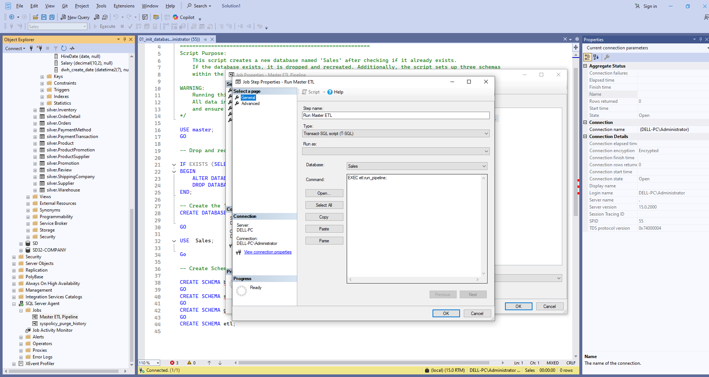
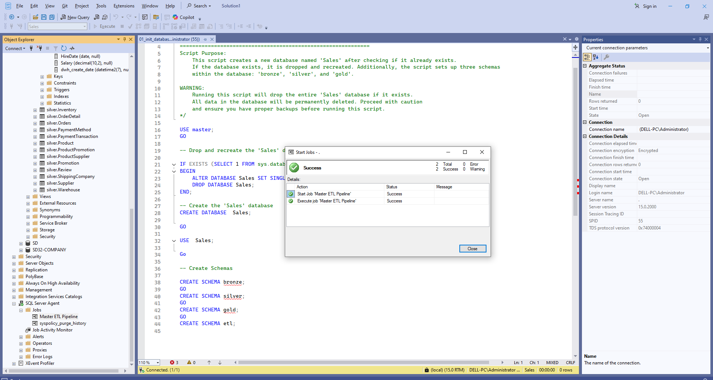
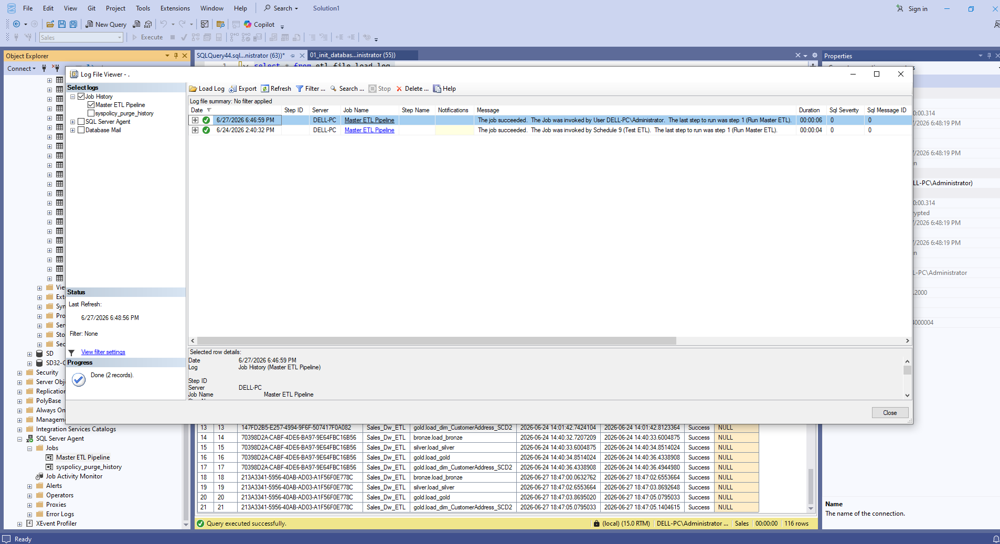

# ⚙️ ETL Process

This project implements a complete **Extract, Transform, Load (ETL)** pipeline following the **Medallion Architecture** (Bronze → Silver → Gold). The pipeline ingests raw operational data from multiple CSV files, applies data quality and business transformation rules, and produces an analytics-ready to generate actionable insights.

---

# ETL Pipeline Workflow

```text
┌──────────────────────────────────────────────────────────────────────┐
│                    SOURCE SYSTEMS (CSV FILES)                        │
│                                                                      │
│   Customer • Address • Orders • Order Details • Products            │
│   Reviews • Suppliers • Warehouses • Inventory                      │
│   Promotions • Employees • Departments                              │
│   Shipping • Payment • Reference Data                               │
│                                                                      │
│                  Total Source Files: 17 CSV Files                    │
└──────────────────────────────────────────────────────────────────────┘
                                │
                                ▼
                         EXTRACT PHASE
                                │
┌──────────────────────────────────────────────────────────────────────┐
│                      STEP 1 : BRONZE LAYER                           │
│                                                                      │
│   ✓ Load all CSV files into SQL Server                              │
│   ✓ Preserve raw source data                                        │
│   ✓ No transformations                                              │
│   ✓ Full Batch Load                                                 │
│   ✓ Truncate & Reload Strategy                                      │
│                                                                      │
│                OUTPUT: Raw Operational Data                          │
└──────────────────────────────────────────────────────────────────────┘
                                │
                                ▼
                      TRANSFORMATION PHASE
                                │
┌──────────────────────────────────────────────────────────────────────┐
│                      STEP 2 : SILVER LAYER                           │
│                                                                      │
│   ✓ Data Cleansing                                                   │
│   ✓ Remove Duplicate Records                                         │
│   ✓ Handle NULL Values                                               │
│   ✓ Standardize Text & Dates                                         │
│   ✓ Trim Spaces                                                      │
│   ✓ Data Type Conversion                                             │
│   ✓ Apply Business Validation Rules                                 │
│   ✓ Generate Metadata Columns                                        │
│   ✓ Data Quality Checks                                              │
│                                                                      │
│             OUTPUT: Cleaned & Standardized Data                      │
└──────────────────────────────────────────────────────────────────────┘
                                │
                                ▼
                     BUSINESS MODELING PHASE
                                │
┌──────────────────────────────────────────────────────────────────────┐
│                       STEP 3 : GOLD LAYER                            │
│                                                                      │
│   ✓ Merge Operational Data                                           │
│   ✓ Build Star Schema                                                │
│   ✓ Generate Surrogate Keys                                          │
│   ✓ Create Dimension Tables                                          │
│   ✓ Create Fact Table                                                │
│   ✓ Apply Business Rules                                             │
│   ✓ Implement SCD Type 2 (Customer Address)                          │
│   ✓ Build Date Dimension                                             │
│   ✓ Optimize for Analytical Queries                                  │
│                                                                      │
│              OUTPUT: Analytics-Ready Sales Data Mart                 │
└──────────────────────────────────────────────────────────────────────┘
                                │
                                ▼
                         CONSUMPTION LAYER
                                │
┌──────────────────────────────────────────────────────────────────────┐
│                    ANALYTICS & REPORTING                             │
│                                                                      │
│   ✓ KPI Analysis                                                     │
│   ✓ Customer Reports                                                 │
│   ✓ Product Reports                                                  │
│   ✓ Trend Analysis                                                   │
│   ✓ Ranking Analysis                                                 │
│   ✓ Customer Segmentation                                            │
│   ✓ Performance Analysis                                             │
│   ✓ SQL Analytics                                                    │
└──────────────────────────────────────────────────────────────────────┘
```

## ETL Orchestration

The ETL workflow is executed by a master stored procedure that orchestrates the Bronze, Silver, and Gold layers, performs quality validation, and records execution details in ETL logging tables.

## Bronze Layer
- Load all 17 CSV files.
- Preserve raw source data.
- Perform full batch loads.
- No transformations.

## Silver Layer
| Transformation | Purpose |
|---------------|---------|
| NULL Handling | Standardize missing values |
| Data Type Conversion | Ensure consistent types |
| String Trimming | Remove extra spaces |
| Date Standardization | Standardize dates |
| Duplicate Removal | Maintain unique business records |
| Business Validation | Improve data reliability |
| Metadata Columns | Support data lineage |

### Example Deduplication
```sql
ROW_NUMBER() OVER (
    PARTITION BY Business_Key
    ORDER BY dwh_create_date DESC
)
```

## Gold Layer

### Dimensions
- DimCustomer
- DimCustomerAddress (SCD Type 2)
- DimProduct
- DimPaymentMethod
- DimShippingCompany
- DimDate

### Fact
- FactSales


## Pipeline Execution

```sql
EXEC etl.run_pipeline;
```

## ETL Scheduling with SQL Server Agent

To automate the ETL pipeline, SQL Server Agent is used to orchestrate the execution of the Master ETL Pipeline job. The job executes the etl.run_pipeline stored procedure, which loads data through the Bronze, Silver, and Gold layers in sequence.
<p align="center">
    
</p>

<p align="center">
    
</p>

<p align="center">
    
</p>

